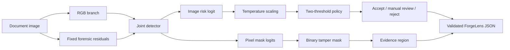

<div align="center">

# ForgeLens

### Calibrated document-forgery detection and pixel localization under generator shift

[](https://www.python.org/)
[](https://pytorch.org/)
[](#quality-gates)
[](https://mypy-lang.org/)
[](LICENSE)

**A reproducible PyTorch research system for image-level forgery risk, pixel-level
tamper localization, calibrated abstention, and evidence-grounded experimentation.**

[Quick start](#quick-start) · [Architecture](#architecture) ·
[Verified results](#verified-results) · [Demo](#local-research-demo) ·
[Documentation](#documentation) · [Responsible use](#responsible-use)

</div>

> [!CAUTION]
> **Research prototype - not forensic proof.** Every current detector checkpoint
> failed operational validation. ForgeLens defaults uncertain cases to manual
> review and must not be used for autonomous KYC, fraud, legal, or identity
> decisions.

---

## Why ForgeLens?

Document-forgery research is difficult for reasons that extend beyond model
architecture: paired derivatives can leak across splits, confidence can be
miscalibrated, a high F1 score can hide catastrophic false positives, and proxy
tampering may not transfer to modern generative edits.

ForgeLens treats these as first-class engineering requirements:

- **Joint detection and localization** - one model produces an image risk logit
  and a pixel tamper mask.
- **Leakage-safe evaluation** - authentic images, forged derivatives, masks, and
  paired generator variants remain in the same source group.
- **Validation-only decisions** - temperature, image thresholds, and mask
  thresholds are selected without test-set tuning.
- **Explicit abstention** - ambiguous scores become `uncertain` with
  `manual_review`, not a forced answer.
- **Strict outputs** - every inference result is validated against a typed
  Pydantic contract.
- **Honest negative results** - failed experiments, confidence intervals,
  checkpoint hashes, latency, and failure analysis remain published.
- **Reproducible execution** - datasets, models, revisions, configurations,
  seeds, dependencies, and artifacts are pinned.

## System at a glance

| Capability | Implementation |
|---|---|
| Image classification | Binary image-level forgery risk |
| Pixel localization | Binary tamper-mask prediction |
| Model families | Tiny RGB, skip-connected U-Net, residual U-Net |
| Forensic inputs | RGB plus optional fixed Laplacian/Sobel residuals |
| Calibration | Validation-fitted temperature scaling |
| Decision policy | Accept / manual review / reject using two thresholds |
| Evaluation | ROC-AUC, PR-AUC, bootstrap CIs, IoU, ECE, Brier, risk-coverage |
| Robustness | Nine deterministic capture and corruption proxies |
| VLM research route | SmolVLM2 LoRA SFT on a free Kaggle GPU |
| Public interface | Strict JSON plus a plain-language local browser UI |
| Quality | 51 tests, Ruff formatting/lint, strict mypy |

## Architecture



The local detector combines global document context with the strongest one
percent of local mask evidence. Its output is then calibrated and passed through
a conservative policy:

```text
risk < accept threshold        -> authentic / accept
between thresholds             -> uncertain / manual_review
risk >= reject threshold       -> forged / reject
```

The current demo uses the rejected `RESIDUAL-COPYMOVE-001` proxy checkpoint.
It does **not** use the Kaggle VLM adapter or the rejected AIForge checkpoint.

## Verified results

Four genuine local GPU experiments were completed on an NVIDIA RTX 2050. All
were rejected for operational use.

| Experiment | Test ROC-AUC (95% CI) | Pixel IoU | Outcome |
|---|---:|---:|---|
| `RGB-COPYMOVE-001` | 0.548 (0.468-0.628) | 0.191 at 0.5 | Rejected |
| `UNET-COPYMOVE-001` | 0.509 (0.436-0.587) | 0.000 at 0.5 | Rejected |
| `RESIDUAL-COPYMOVE-001` | 0.525 (0.452-0.610) | 0.051 validation-selected | Rejected |
| `AIFORGE-CORD-UNET-001` | 0.502 (0.444-0.558) | 0.020 validation-selected | Rejected |

### What the results mean

- Every ROC-AUC confidence interval includes chance performance.
- The paired GPT-Image-2/CORD experiment produced a false-positive rate of
  `1.0` at its validation-selected operating point.
- Low calibration error in the primary experiment came from near-constant
  scores around 0.5, not useful discrimination.
- Copy-move manipulation was not a credible proxy for AI inpainting.
- Batch-one residual inference measured **2.45 ms median FP32** and
  **27 MiB peak VRAM**, but speed does not compensate for invalid accuracy.

See the [technical report](reports/technical_report.md), complete
[experiment log](docs/experiment_log.md), and machine-readable
[result records](results/).

## Free-GPU VLM experiment

The private Kaggle route fine-tuned
[`HuggingFaceTB/SmolVLM2-2.2B-Instruct`](https://huggingface.co/HuggingFaceTB/SmolVLM2-2.2B-Instruct)
with LoRA on a deterministic public CORD copy-move proxy.

| Measure | Zero-shot | LoRA SFT |
|---|---:|---:|
| Balanced accuracy | 0.500 | 0.547 |
| Authentic recall | 1.000 | 0.719 |
| Forged recall | 0.000 | 0.375 |

The run completed one epoch and 16 optimizer steps on a Tesla T4, using
approximately 7.0 GiB peak allocated VRAM. This verifies the free-GPU workflow;
the 64-example proxy test does **not** establish AI-inpainting or production
performance.

## Quick start

### Requirements

- Windows with PowerShell
- Python 3.14
- Optional CUDA-capable NVIDIA GPU
- Repository and project storage below `F:\HYPERVERGE`

### Install and verify

```powershell
cd F:\HYPERVERGE\forgelens
.\tools\run.ps1 sync
.\tools\run.ps1 cuda
.\tools\run.ps1 verify
```

`verify` runs formatting checks, lint, strict type checking, and the complete
test suite.

### Start the demo

```powershell
.\tools\run.ps1 demo
```

Open [http://127.0.0.1:7860](http://127.0.0.1:7860).

### Deploy from GitHub to Vercel

The repository includes a static frontend and a Python 3.14 Vercel Function.
Import `Freak205/FORGELENS` in Vercel, keep the project root as `./`, and leave
the detected build settings unchanged. No application secrets or environment
variables are required. Every push to `main` creates a production deployment;
other branches and pull requests create preview deployments.

The hosted route accepts PNG, JPEG, and WebP images up to 4 MiB, matching
Vercel's request-size ceiling with safety margin. The local demo retains its
10 MiB limit. New Vercel projects use Fluid Compute and may package this
PyTorch function as a Large Function. If an older Vercel project reports a
function-size error, set `VERCEL_SUPPORT_LARGE_FUNCTIONS=1` for Preview first,
redeploy, and then enable it for Production after verification.

Deployment remains a research demonstration, not a production inference
service or forensic proof. The bundled checkpoint failed operational
validation and all outputs require manual review.

## Local research demo

The dependency-light demo:

- binds only to `127.0.0.1`;
- accepts PNG, JPEG, and WebP images up to 10 MiB;
- validates and converts uploads with Pillow;
- runs on CUDA when available, otherwise CPU;
- returns a typed JSON record, saved mask, latency, and model-status warning;
- presents a plain-language **What this means** card for non-technical users;
- disables caching and emits `nosniff` response headers.

Use only non-sensitive receipts, invoices, tickets, or fictional forms. Do not
upload identity documents, bank statements, medical records, biometrics, faces,
or customer data.

### Output contract

```json
{
  "verdict": "uncertain",
  "calibrated_risk": 0.3767,
  "tamper_type": "unknown",
  "affected_fields": [],
  "evidence_regions": [
    {
      "box": [6, 0, 282, 190],
      "observation": "Model evidence, not forensic proof."
    }
  ],
  "tamper_mask_path": "...",
  "recommended_action": "manual_review",
  "limitations": [
    "Research prototype; not forensic proof."
  ]
}
```

White mask pixels show locations where the localization head exceeded its
configured threshold. They may be ordinary text edges, borders, or compression
artifacts and are not confirmed tampering.

## Data and provenance

| Asset | Role | Policy |
|---|---|---|
| CORD v2 | Authentic receipt source | Revision-pinned; official 800/100/100 splits |
| CORD copy-move v1 | Engineering proxy | Deterministic paired derivatives and exact masks |
| AIForge-Doc v2 | GPT-Image-2 research benchmark | Gated; non-commercial research handling |
| AIForge CORD paired subset | Primary local experiment | Source-group-preserving 1,258/314/394 split |

Manifests carry sample IDs, source groups, paths, labels, masks, splits,
metadata, and checksums. Paths are resolved under the configured storage root
and rejected if they escape it.

See the [dataset register](docs/dataset_register.md) for licences, revisions,
access restrictions, privacy risks, and selection decisions.

## Reproducible workflows

The task runner keeps environments, caches, data, checkpoints, temporary files,
and generated artifacts below `F:\HYPERVERGE`.

```powershell
# Data
.\tools\run.ps1 download-cord
.\tools\run.ps1 extract-cord
.\tools\run.ps1 manifest-cord
.\tools\run.ps1 build-cord-copy-move
.\tools\run.ps1 download-aiforge-v2
.\tools\run.ps1 manifest-aiforge-cord

# Training and evaluation
.\tools\run.ps1 smoke-train
.\tools\run.ps1 train-real-baseline
.\tools\run.ps1 train-unet-baseline
.\tools\run.ps1 train-residual-baseline
.\tools\run.ps1 train-aiforge-baseline
.\tools\run.ps1 evaluate-primary
.\tools\run.ps1 benchmark-inference
.\tools\run.ps1 report-assets

# Free Kaggle route
.\tools\run.ps1 kaggle-auth-check
.\tools\run.ps1 kaggle-push-kernel
.\tools\run.ps1 kaggle-download-output
```

Credentials are collected through hidden prompts, encrypted with Windows DPAPI,
loaded only for the relevant command, and never committed.

## Repository layout

```text
forgelens/
|-- src/forgelens/
|   |-- data/          # Manifests, adapters, splits, typed samples
|   |-- models/        # RGB, U-Net, and residual joint detectors
|   |-- training/      # Trainer, checkpoints, reproducibility
|   |-- calibration/   # Temperature scaling and operating policy
|   |-- evaluation/    # Metrics, ranking, confidence intervals
|   `-- inference/     # Strict output assembly
|-- configs/           # Dataset, model, baseline, and training configs
|-- scripts/           # Acquisition, preparation, training, evaluation
|-- cloud/kaggle/      # SmolVLM2 LoRA free-GPU package
|-- demo/              # Local HTTP server and browser interface
|-- tests/             # Unit and integration tests
|-- results/           # Immutable machine-readable experiment records
|-- reports/           # Technical report, figures, tables, failures
|-- docs/              # Architecture, ethics, model card, research evidence
`-- tools/run.ps1      # Reproducible task entry point
```

## Quality gates

The current `main` branch passes:

- **51 tests**
- Ruff formatting check
- Ruff lint
- strict mypy type checking
- local HTTP inference integration tests
- model, data, calibration, evaluation, robustness, checkpoint, VLM-bundle,
  and demo-UI tests

Run the same gate locally:

```powershell
.\tools\run.ps1 verify
```

## Responsible use

### Intended

- Licensed, fictional, or non-sensitive receipt/form research
- Studying calibration, abstention, localization, and generator shift
- Reproducing negative results and testing research hypotheses
- Human-reviewed analysis where outputs are treated as unverified evidence

### Not intended

- Real identity documents or biometric processing
- Autonomous acceptance or rejection
- KYC, banking, immigration, insurance, employment, or legal decisions
- Claims of authenticity, identity, intent, provenance, or admissibility
- Operational forgery generation
- Treating a score as a validated probability or a mask as forensic proof

Read the [model card](docs/model_card.md), [limitations](docs/limitations.md),
[ethics statement](docs/ethics.md), and [threat model](docs/threat_model.md)
before extending or evaluating the system.

## Documentation

| Document | Purpose |
|---|---|
| [Architecture](docs/architecture.md) | Model and data flow |
| [Technical report](reports/technical_report.md) | Consolidated verified evidence |
| [Experiment log](docs/experiment_log.md) | Full run history and decisions |
| [Reproducibility](docs/reproducibility.md) | Storage, credentials, and commands |
| [Dataset register](docs/dataset_register.md) | Provenance, licences, and access |
| [Model card](docs/model_card.md) | Intended use and current status |
| [Failure gallery](reports/failure_gallery.md) | Preserved qualitative failures |
| [Research plan](docs/research_plan.md) | Question, evaluation, and milestones |

## Citation

If ForgeLens informs your work, cite the software using [`CITATION.cff`](CITATION.cff)
and separately cite every upstream dataset and model you use.

## License

ForgeLens source code is released under the [Apache License 2.0](LICENSE).
Datasets, pretrained models, published baselines, and generated derivatives
retain their own licences and access conditions.

---

<div align="center">

**A working pipeline is not automatically a trustworthy model. ForgeLens keeps
that distinction visible.**

</div>
