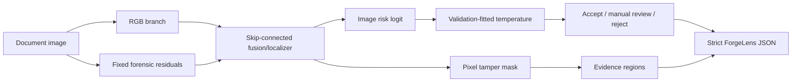
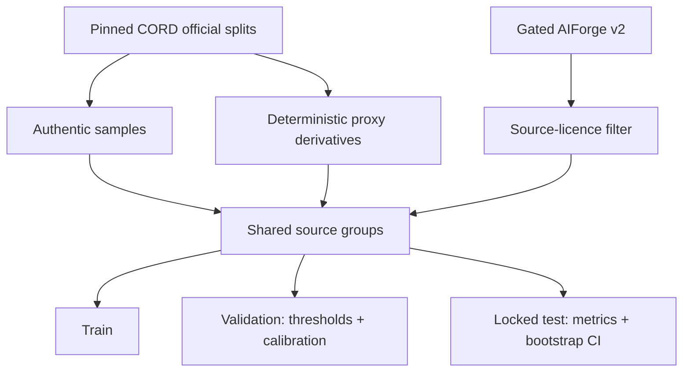

# Architecture and Data Flow

```mermaid
flowchart LR
  I["Document image"] --> R["RGB branch"]
  I --> H["Fixed forensic residuals"]
  R --> F["Skip-connected fusion/localizer"]
  H --> F
  F --> M["Pixel tamper mask"]
  F --> C["Image risk logit"]
  C --> T["Validation-fitted temperature"]
  T --> P["Accept / manual review / reject"]
  M --> E["Evidence regions"]
  P --> J["Strict ForgeLens JSON"]
  E --> J
```

```mermaid
flowchart TD
  C["Pinned CORD official splits"] --> D["Authentic samples"]
  C --> S["Deterministic proxy derivatives"]
  D --> G["Shared source groups"]
  S --> G
  A["Gated AIForge v2"] --> L["Source-licence filter"]
  L --> G
  G --> TR["Train"]
  G --> VA["Validation: thresholds + calibration"]
  G --> TE["Locked test: metrics + bootstrap CI"]
```
