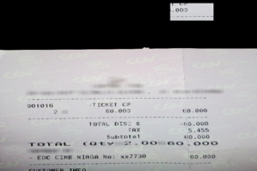
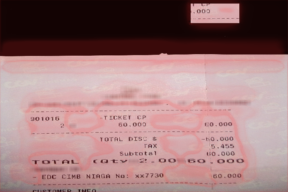
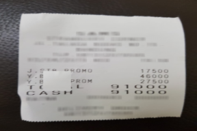
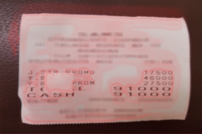
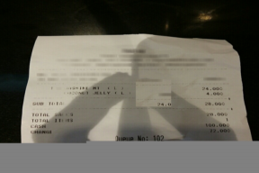
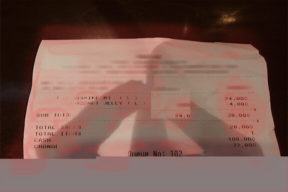

# Failure Gallery

These are actual predictions from rejected `RESIDUAL-COPYMOVE-001`. Red
intensity is predicted tamper probability. They demonstrate weak, diffuse
evidence rather than successful localization.

| Input | Exact target | Prediction |
|---|---|---|
|  |  |  |
|  |  |  |
|  |  |  |

The proxy task did not produce a transferable forensic signal. No qualitative
example is presented as a success.
