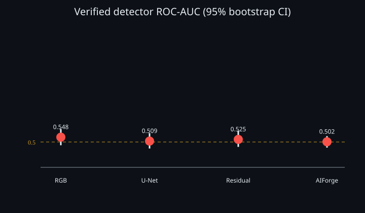
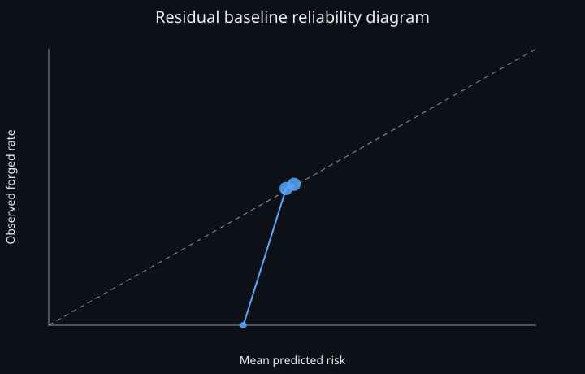

# ForgeLens: Interim Technical Report

## Abstract

ForgeLens is a tested PyTorch prototype for calibrated document-forgery
detection and pixel localization under generator shift. Four local models were
genuinely trained, including a paired GPT-Image-2/CORD experiment; all were
rejected because confidence intervals included chance and thresholds caused
near-total false positives.

## Scope, data, and method

The target is localized numeric/text manipulation in receipts and forms.
Outputs include risk, abstention, evidence regions, a mask, and manual-review
action. CORD v2 is pinned at revision
`7f0115a4b758a71d6473b8d085751692da2fef98` under CC BY 4.0 with official
800/100/100 splits. Models jointly predict image logits and pixel masks;
thresholds and temperatures are selected on validation only.

## Verified experiments

| Experiment | Test ROC-AUC (95% CI) | Pixel IoU | Decision |
|---|---:|---:|---|
| RGB-COPYMOVE-001 | 0.548 (0.468–0.628) | 0.191 at 0.5 | Reject |
| UNET-COPYMOVE-001 | 0.509 (0.436–0.587) | 0.000 at 0.5 | Reject |
| RESIDUAL-COPYMOVE-001 | 0.525 (0.452–0.610) | 0.051 validation-selected | Reject |
| AIFORGE-CORD-UNET-001 | 0.502 (0.444–0.558) | 0.020 validation-selected | Reject |

The negative results show copy-move is not a credible proxy for AI inpainting.
Exact records and checkpoint hashes are in `results/`.

## Calibration, robustness, published and VLM baselines

Temperature scaling, ECE, Brier score, abstention, bootstrap intervals, and
nine deterministic corruptions were evaluated on the paired AIForge test set.
At 50% coverage, selective error remained 0.492; corruption AUCs stayed near
chance (0.500–0.503). TruFor source/licences are pinned, but its official
weight host timed out, so reproduction is not claimed. A private free-Kaggle
SmolVLM2 mixed-precision LoRA proxy job uses public CORD only and must not be interpreted
as AI-inpainting performance. Its submitted version currently stops because
Kaggle launches the account session without CUDA; no VLM result is claimed.

## Efficiency

On RTX 2050, batch-one 192×288 inference measured 2.45 ms median FP32 and
27.0 MiB peak VRAM. AMP was slower (3.84 ms), so FP32 is retained.

## Limitations and ethics

No current checkpoint is operationally acceptable. The single-generator
AIForge result is negative; no cross-generator, VLM, or in-the-wild performance
claim is made. ForgeLens is
not forensic proof and excludes real identity documents, biometric collection,
and operational forgery generation.

Actual qualitative failures are preserved in `reports/failure_gallery.md`.
